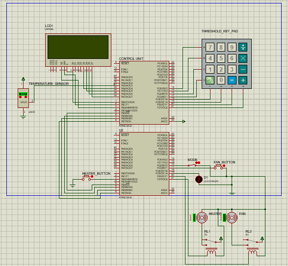

# Temperature Control System with Manual and Automatic Modes 🌡️

## Overview

This project implements a temperature control system capable of operating in both **manual** and **automatic** modes. The system is built using an **RTOS (Real-Time Operating System)** to ensure real-time operation and multitasking. ⚙️

The system utilizes two **AtMega32** microcontrollers connected via the **SPI (Serial Peripheral Interface)** protocol:

- **Control Unit**: Handles temperature reading, threshold selection (via keypad), and display (on an LCD). 📟  
- **Manual Unit**: Manages heater and fan control through manual switches and push buttons, enabled via external interrupts. 🔧

---

## System Features 🌟

1. **Automatic Mode**:
   - Reads temperature using an **LM35 sensor**.
   - Automatically controls the **heater** and **fan** to maintain the desired temperature threshold. 🌡️🌬️
   
2. **Manual Mode**:
   - Allows users to directly control the heater and fan using switches and buttons. 🖲️
   - External interrupts ensure responsive manual control.

3. **User Interface**:
   - A **16x2 LCD** for temperature display and feedback. 📺
   - A **4x4 Keypad** for user input to set thresholds and select modes. ⌨️
   - **Buttons & switch** for controlling manual mode. 🖲️

4. **Communication**:
   - **SPI protocol** for seamless communication between the two microcontrollers. 🔄

---

## Components 🔩

- **Microcontrollers**:
  - 2 x AtMega32 🖥️
- **Sensors and Actuators**:
  - LM35 temperature sensor 🌡️
  - Fan and Heater (controlled via relays) 🌬️🔥
- **User Interface**:
  - 16x2 LCD 📟
  - 4x4 Keypad ⌨️
  - 1 Mode Switch 🔘
  - 2 Push Buttons for manual control 🖲️
- **Other Components**:
  - 2 Relays ⚡
  - Jumpers for connections 🔗

---

## System Architecture 🏗️

The project is modularly designed with a layered architecture:

### **Hardware Abstraction Layer (HAL)** 🛠️
- **LCD Driver**: Displays temperature and user prompts. 📺
- **Relay Driver**: Controls the heater and fan. ⚡
- **Switch Driver**: Detects manual mode activation. 🔘
- **Keypad Driver**: Captures user input. ⌨️
- **LM35 Driver**: Reads and converts temperature data. 🌡️

### **Microcontroller Abstraction Layer (MCAL)** 🔧
- **Global Interrupts**: Enables system-wide interrupt handling. 🚨
- **External Interrupts**: Handles manual mode switch and push buttons. 🖲️
- **DIO (Digital Input/Output)**: Manages GPIO configuration. 🔌
- **ADC (Analog-to-Digital Converter)**: Reads temperature sensor data. 📊
- **Timers**:
  - Handles task scheduling in RTOS. ⏱️
  - Generates PWM signals for temperature level Led showing. 🎛️
  - Handles communication timing. ⏱️
- **SPI Protocol**: Ensures communication between microcontrollers. 🔄

---

## Circuit Diagram Preview 📷


---

## Usage Instructions 📖

1. **Pull the Project**: 
   Clone the repository to your local machine using the following command:
   
   ```bash
   git clone https://github.com/AbdelrahmanAtef01/Temperature-Control-System
   ```
3. **Setup Hardware**:
   - Connect all components as per the circuit diagram.
   - Ensure proper power supply and connections for all components. 🔌
4. **Flash the Code**:
   - Flash the appropriate code to each microcontroller:
     - **Control Unit**: Upload the control logic for temperature reading, threshold setting, and SPI communication.
     - **Manual Unit**: Upload the logic for fan and heater control, manual mode, and SPI communication.
5. **Run the System**:
   - Power on the system. ⚡
   - Use the **switch** to toggle between **manual** and **automatic** modes:
     - In **automatic mode**, set the temperature threshold using the **keypad**. The system will maintain the desired temperature automatically. 🌡️
     - In **manual mode**, control the heater and fan directly using the **push buttons**. 🔧
   - Monitor the temperature, threshold and system status on the **LCD** display. 📟

---

## Future Improvements 🚀
- Add remote monitoring using UART or I2C. 📡
- Implement safety features for overheating or sensor failure. 🚨
- Enhance functionality with additional sensors (e.g., humidity). 💧
